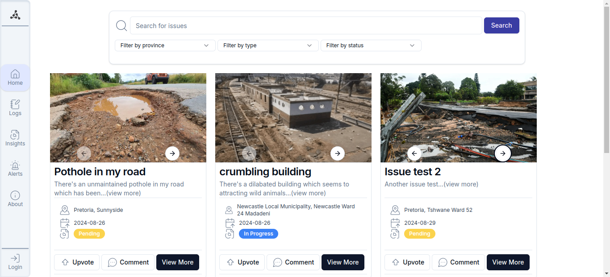

# FixMzansi_V2

FixMzansi_V2 is a web application designed to help users report and track various issues within their community. The application consists of a frontend built with Next.js and a backend built with Django.

## Screenshot


## Table of Contents

- [FixMzansi_V2](#fixmzansi_v2)
  - [Table of Contents](#table-of-contents)
  - [Project Structure](#project-structure)
  - [Installation](#installation)
    - [Frontend](#frontend)
    - [Backend](#backend)
  - [Usage](#usage)
    - [Running the Frontend](#running-the-frontend)
    - [Running the Backend](#running-the-backend)
  - [API Documentation](#api-documentation)
    - [Authentication](#authentication)
    - [Endpoints](#endpoints)
  - [License](#license)


## Installation

### Frontend

1. Navigate to the [`frontend`]("/frontend") directory:
    ```sh
    cd frontend
    ```

2. Install the dependencies:
    ```sh
    npm install
    ```

3. Create a new file named `.env` in the root of the frontend directory.

4. Open the `.env` file and add the following content:
    ```sh
    NEXTAUTH_SECRET=YOUR_NEXTAUTH_SECRET
    NEXTAUTH_URL=YOUR_NEXTAUTH_URL
    ```

### Backend

1. Navigate to the [`backend`]("/backend") directory:
    ```sh
    cd backend
    ```

2. Create a virtual environment:
    ```sh
    python -m venv .venv
    ```

3. Activate the virtual environment:
    - On Windows:
        ```sh
        .venv\Scripts\activate
        ```
    - On macOS/Linux:
        ```sh
        source .venv/bin/activate
        ```

4. Install the dependencies:
    ```sh
    pip install -r requirements.txt
    ```

5. Create a new file named `.env` in the root of the backend directory.

6. Open the `.env` file and add the following content:
    ```sh
    SECRET_KEY=YOUR_SECRET
    ```

7. Apply the migrations:
    ```sh
    python manage.py migrate
    ```

## Usage

### Running the Frontend

1. Navigate to the [`frontend`]() directory:
    ```sh
    cd frontend
    ```

2. Start the development server:
    ```sh
    npm run dev
    ```

3. Open your browser and go to `http://localhost:3000`.

### Running the Backend

1. Navigate to the [`backend`]() directory:
    ```sh
    cd backend
    ```

2. Start the development server:
    ```sh
    python manage.py runserver
    ```

3. The backend API will be available at `http://localhost:8000`.

## API Documentation

### Authentication

To access the API endpoints, you need to include an [`Authorization`]() header in your requests. The value of the header should be a valid JWT token.

### Endpoints

#### 1. [`/users`]()

- [`GET /users`]() - Retrieve a list of all users.
- [`GET /users/{id}`]() - Retrieve a specific user by ID.
- [`POST /users`]() - Create a new user.
- [`PUT /users/{id}`]() - Update an existing user.
- [`DELETE /users/{id}`]() - Delete a user.

#### 2. [`/issues`]()

- [`GET /issues/`]() - Retrieve a list of all posts.
- [`GET /issues/{id}`]() - Retrieve a specific post by ID.
- [`POST /issues/`]() - Create a new post.
- [`PUT /issues/`]() - Update an existing post.
- [`DELETE /issues/{id}`]() - Delete a post.

#### 3. [`/comments`]()

- [`GET /issues/comments`]() - Retrieve a list of all comments.
- [`GET /issues/comments/{id}`]() - Retrieve a specific comment by ID.
- [`POST /issues/comments`]() - Create a new comment.
- [`PUT /issues/comments/{id}`]() - Update an existing comment.
- [`DELETE /issues/comments/{id}`]() - Delete a comment.

#### 4. [`/mediacontent`]()

- [`GET /issues/media`]() - Retrieve a list of all media content.
- [`GET /issues/media/{id}`]() - Retrieve a specific media content by ID.
- [`POST /issues/media/`]() - Create a new media content.
- [`PUT /issues/media/`]() - Update an existing media content.
- [`DELETE /issues/media/{id}`]() - Delete a media content.

#### 5. [`/upvotes`]()

- [`GET /issues/upvotes/`]() - Retrieve a list of all upvotes.
- [`GET /issues/upvotes/{id}`]() - Retrieve a specific upvote by ID.
- [`POST /issues/upvotes/`]() - Create a new upvote.
- [`PUT /issues/upvotes/`]() - Update an existing upvote.
- [`DELETE /issues/upvotes/{id}`]() - Delete an upvote.

#### 6. [`/downvotes`]()

- [`GET /issues/downvotes/`]() - Retrieve a list of all downvotes.
- [`GET /issues/downvotes/{id}`]() - Retrieve a specific downvote by ID.
- [`POST /issues/downvotes/`]() - Create a new downvote.
- [`PUT /issues/downvotes/`]() - Update an existing downvote.
- [`DELETE /issues/downvotes/{id}`]() - Delete a downvote.

#### 7. [`/alerts`]()

- [`GET /alerts/`]() - Retrieve a list of all alerts.
- [`GET /alerts/{id}`]() - Retrieve a specific alert by ID.
- [`POST /alerts/`]() - Create a new alert.
- [`PUT /alerts/`]() - Update an existing alert.
- [`DELETE /alerts/{id}`]() - Delete an alert.

## License

This project is licensed under the MIT License. See the [`LICENSE`]("/LICENSE") file for more details.
